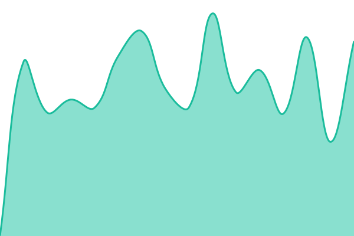

# [📈 Live Status](https://dvasincom-sketch.github.io/content-box-status): <!--live status--> **🟥 Complete outage**

This repository contains the open-source uptime monitor and status page for [dvasincom-sketch](https://dvasincom-sketch.github.io/content-box-status), powered by [Upptime](https://github.com/upptime/upptime).

With [Upptime](https://upptime.js.org), you can get your own unlimited and free uptime monitor and status page, powered entirely by a GitHub repository. We use [Issues](https://github.com/dvasincom-sketch/content-box-status/issues) as incident reports, [Actions](https://github.com/dvasincom-sketch/content-box-status/actions) as uptime monitors, and [Pages](https://dvasincom-sketch.github.io/content-box-status) for the status page.

<!--start: status pages-->
<!-- This summary is generated by Upptime (https://github.com/upptime/upptime) -->
<!-- Do not edit this manually, your changes will be overwritten -->
<!-- prettier-ignore -->
| URL | Status | History | Response Time | Uptime |
| --- | ------ | ------- | ------------- | ------ |
|  [Сайт Coco Jambo](https://btsrussia.ru/) | Недоступен | [sajt-coco-jambo.yml](https://github.com/dvasincom-sketch/content-box-status/commits/HEAD/history/sajt-coco-jambo.yml) | 

 1712мс
     
 | 

<a href="https://dvasincom-sketch.github.io/content-box-status/history/sajt-coco-jambo">94.84%</a>
    

|  [Приложение и база (health)](https://btsrussia.ru/api/health) | Недоступен | [prilozhenie-i-baza-health.yml](https://github.com/dvasincom-sketch/content-box-status/commits/HEAD/history/prilozhenie-i-baza-health.yml) | 

 736мс
     
 | 

<a href="https://dvasincom-sketch.github.io/content-box-status/history/prilozhenie-i-baza-health">95.78%</a>
    

<!--end: status pages-->

[**Visit our status website →**](https://dvasincom-sketch.github.io/content-box-status)

## 📄 License

- Powered by: [Upptime](https://github.com/upptime/upptime)
- Code: [MIT](./LICENSE) © [Anand Chowdhary](https://anandchowdhary.com)
- Data in the `./history` directory: [Open Database License](https://opendatacommons.org/licenses/odbl/1-0/)
